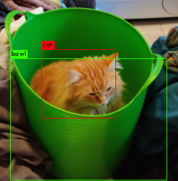

# pussyspotter
Slack app detecting cats++ using Yolov3.

# Installation

$ `git clone --recursive git@github.com:tordnat/pussyspotter.git`

Install ngrok.
$ `curl -s https://ngrok-agent.s3.amazonaws.com/ngrok.asc | sudo tee /etc/apt/trusted.gpg.d/ngrok.asc >/dev/null &&
              echo "deb https://ngrok-agent.s3.amazonaws.com buster main" | sudo tee /etc/apt/sources.list.d/ngrok.list &&
              sudo apt update && sudo apt install ngrok   
              `
## Acknowledgements
Thanks for all the test-pussy, Emilie and Ida. 

## Sources

